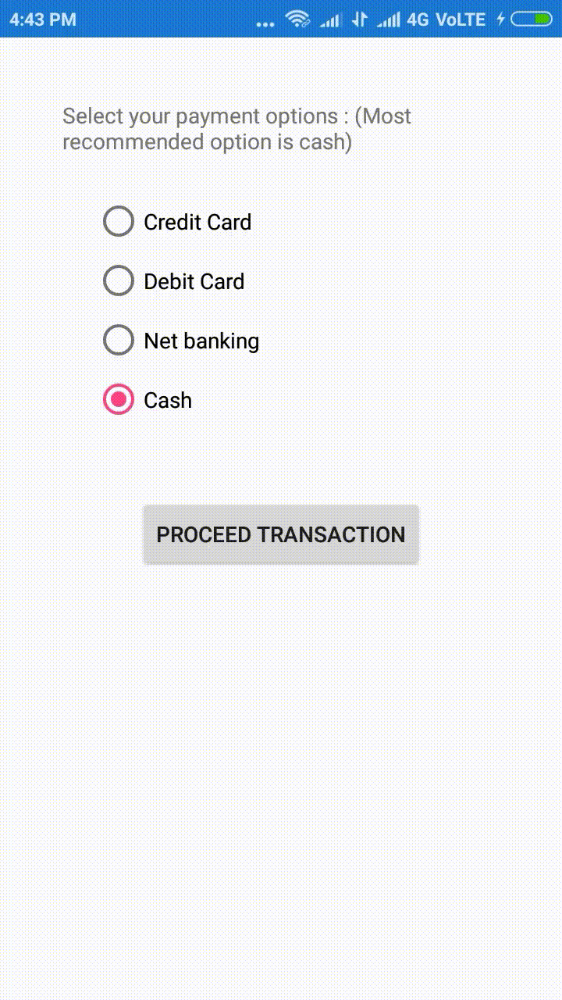

# How-to-create-a-Xamarin.Forms-RadioButton

This article shows how to add Xamarin.Forms SfRadioButton in your application in order to obtain the single selection among the multiple choices. 

Let’s have a use case to choose the payment option to make the success transaction. Here, we select any one from the list of payment options. The following steps will guide you to obtain the similar UI that in below



Step 1: Install the Syncfusion.Xamarin.Buttons NuGet to your application as specified in the following guidelines.

https://help.syncfusion.com/xamarin/radio-button/getting-started#adding-sfradiobutton-reference

Step 2: Include a namespace to access the RadioButton in the application.
```
 xmlns:buttons="clr-namespace:Syncfusion.XForms.Buttons;assembly=Syncfusion.Buttons.XForms"
 ```

Step 3: Initialize the list of Xamarin RadioButton inside the SfRadioGroup/layout with group key functionality in order to maintain the grouping. Please use the below code snippet to obtain the above mentioned UI.

[XAML]
```

    <ContentPage.BindingContext>
        <local:ViewModel/>
    </ContentPage.BindingContext>

    <StackLayout Margin="40">
        <Label Text="Select your payment options : (Most recommended option is cash)"/>
        <buttons:SfRadioGroup  Margin="20">
        <buttons:SfRadioButton Text="Credit Card" />
        <buttons:SfRadioButton Text="Debit Card" />
        <buttons:SfRadioButton Text="Net banking" />
        <buttons:SfRadioButton Text="Cash" IsChecked="{Binding IsChecked}"/>
        </buttons:SfRadioGroup>
        <Button Text="Proceed Transaction" HorizontalOptions="Center" VerticalOptions="Center" Margin="20" Command="{Binding TransactionCommmand}"/>
    </StackLayout>
```
[C#] ViewModel.cs
```
public class ViewModel
    {
        private bool isChecked = true;

        public Command TransactionCommmand { get; set; }
        public bool IsChecked
        {
            get { return isChecked; }
            set { isChecked = value; }
        }

        public ViewModel()
        {
            TransactionCommmand = new Command(DoTransaction);
        }
        
        private void DoTransaction()
        {
            App.Current.MainPage.DisplayAlert("Hello","Transaction is Initiated ","Ok");
        }
    }
```

## See also

[Customize the appearance of Xamarin RadioButton](https://help.syncfusion.com/xamarin/radio-button/visual-customization)

[How to group the Xamarin RadioButton](https://help.syncfusion.com/xamarin/radio-button/grouping)

Also refer our [feature tour](https://www.syncfusion.com/xamarin-ui-controls/xamarin-radio-button) page to know more features available in our radio button.

# Troubleshooting

## Path too long exception
If you are facing path too long exception when building this example project, close Visual Studio and rename the repository to short and build the project.

